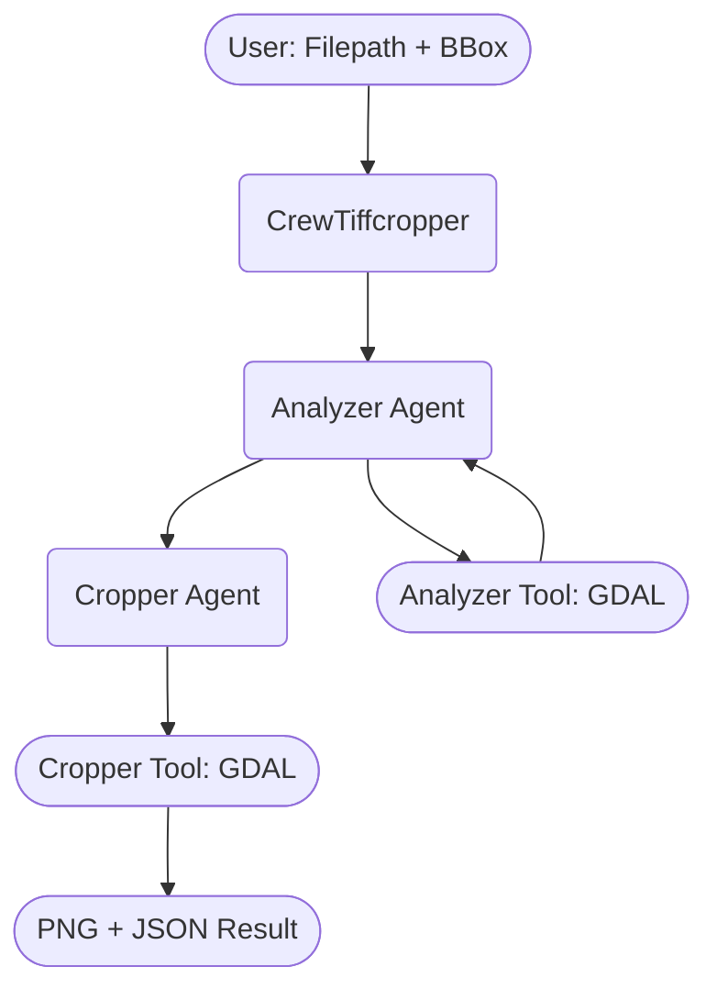

# 🛰️ CrewAI Geospatial TIFF/JP2 Analyzer & Cropper

A modular, agent-based Python system for automated geospatial **TIFF/JP2 raster file analysis and cropping** using [CrewAI](https://github.com/joaomdmoura/crewAI).  
It leverages AI-powered “agents” to **analyze raster metadata** and **crop images via bounding box**, with support for TIFF and JP2 formats and seamless PNG output.

---

## 🚀 Features

- **Automatic geospatial analysis** of TIFF/JP2 files (minx, miny, maxx, maxy extraction)
- **Bounding box cropping** and conversion to PNG
- **Modular CrewAI agents**: plug-and-play, easily extensible with new tools/tasks
- **Strict tool-calling**: always runs tools, never returns hypothetical data
- **YAML-based config** for agent/task goals and roles
- **Fully open source, developer-friendly**

---
## 🖼️ Architecture

## 🛠️ Tech Stack

- **Python 3.10+**
- [CrewAI](https://github.com/joaomdmoura/crewAI)
- [GDAL](https://gdal.org/) (for geospatial image processing)
- [Pydantic](https://docs.pydantic.dev/)
- [PyYAML](https://pyyaml.org/)

---

